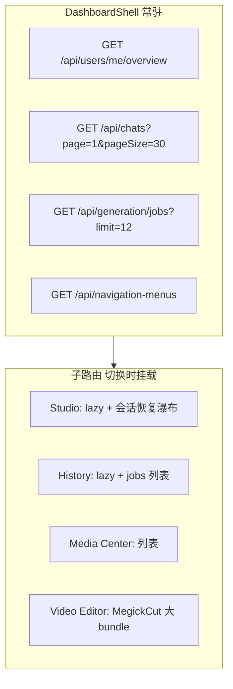

# Dashboard 侧边栏切换性能分析

本文档记录用户反馈「切换左边菜单很慢」的排查结论与后续优化方向。与 [聊天查询优化方案](./聊天查询优化方案.md) 中 `GET /api/chats` 改造存在关联。

---

## 1. 现象

- 在 Dashboard 内点击左侧导航（图片 Studio、视频 Studio、生成历史、素材中心、对话历史等）时，页面响应慢。
- 与数据库总数据量关系不大；重度用户、首次进入某菜单、或刚修完 chat list 后更明显。

---

## 2. 架构概览

- 布局：`apps/web/src/routes/dashboard.tsx` → lazy `DashboardShell` → `<Outlet />` 子路由。
- 侧边栏：`apps/web/src/routes/-dashboard-shell.tsx`。
- 子路由多为 **代码分割（lazy）**，首次进入需下载 JS chunk。

---

## 3. 根因分析（多层叠加）

### 3.1 路由懒加载（首切最明显）

| 菜单 | 加载链 |
|------|--------|
| 图片 / 视频 Studio | `dashboard.studio.*` → lazy `StudioPage` → lazy `ImageStudioPanel` / `VideoStudioPanel` |
| 生成历史 | lazy `HistoryPage` |
| 视频剪辑 | `MegickCutEditorShell`（体积大，含编辑器 / WASM） |

相关文件：

- `apps/web/src/routes/dashboard.tsx`
- `apps/web/src/routes/dashboard.studio.image.tsx`
- `apps/web/src/routes/-studio-panel.tsx`

侧边栏 `Link` **未设置** `preload="intent"`，悬停不会预加载 chunk，只能点击后再加载。

`apps/web/src/router.tsx` 中 `defaultPreloadStaleTime: 0`，预加载策略偏保守。

---

### 3.2 `GET /api/chats` 热修后的 N+1 查询（高可疑）

为规避 MySQL 1038，列表接口改为：

1. 1 次 `chat_sessions` 分页查询  
2. 每个会话 2 次定点查询（`jobs` take 5 + `messages` take 8）

实现：`apps/api/src/modules/chats/chat-list-mode-hints.ts` → `loadChatListModeHints()`。

**一页 30 条会话 ≈ 61 次数据库往返。**

调用方：

| 位置 | 行为 |
|------|------|
| `-dashboard-shell.tsx` | 登录后 `chatsQ`，`staleTime: 30000` |
| `-studio-shared.tsx` | 无 `sessionId` 时 `restoreLastSession` → `fetchQuery` 同一 key |
| `dashboard.chats.tsx` | 对话历史页分页 |
| `session-media.ts` | 编辑器导入 `fetchAllChatSessions`（最多 10 页） |

菜单切换时 Shell 通常不卸载，但若缓存过期、Studio 再次 `fetchQuery`，会拖慢**整页可交互时间**。

---

### 3.3 Studio 会话恢复「请求瀑布」

进入图片 / 视频 Studio 且无 URL `sessionId` 时（`-studio-shared.tsx`）：

1. `fetchChatSessions`（可能很慢，见 3.2）  
2. 找不到 remembered session 时 → `GET /api/chats/:id?limit=1`  
3. `navigate` 写入 `sessionId`  
4. `loadSessionDetail` → `GET /api/chats/:id?limit=10`  
5. 并行 `GET /api/ai-models`（`-studio-panel.tsx`）

图片 Studio ↔ 视频 Studio 为**不同路由**，切换会卸载 / 重挂载，上述流程可能重复。

---

### 3.4 各子页面首屏 API

| 菜单 | 主要请求 | 备注 |
|------|----------|------|
| 生成历史 | `GET /api/generation/jobs` | 有 queued/running 时每 3s 轮询 |
| 素材中心 | `GET /api/media-center` | 每页 48 条 |
| 对话历史 | 分页 `GET /api/chats` | 同 3.2 |
| Shell 全局 | `overview`、`notifications` | notifications 每 15s 轮询 |

全局 React Query 默认 `staleTime: 30s`（`apps/web/src/lib/query-client.ts`），`refetchOnWindowFocus: false`。

---

### 3.5 与「数据库不大」的关系

慢主要来自：

- **前端**：懒加载 chunk、多接口瀑布、Studio / 剪辑器大包  
- **后端**：单次 `GET /api/chats` 的 N+1 SQL（修 1038 的代价）  
- **不是**整库容量问题，而是**一切换菜单就要加载新代码 + 打一批 API**

---

## 4. 验证方法

Chrome DevTools：

1. **Network**：切菜单时是否先出现大体积 `.js`；`/api/chats` 耗时是否数百 ms～数秒。  
2. **Performance**：是否长时间卡在 Scripting / Loading。  
3. 对比：对话历史 / 素材中心 vs Studio / 视频剪辑，后者通常更慢。

后端：对该用户统计 `GET /api/chats` 的 SQL 次数与 P95 延迟。

---

## 5. 优化方向（按收益排序）

| 优先级 | 项 | 说明 | 相关代码 |
|--------|-----|------|----------|
| P0 | 合并 chat list mode hints | ~~1～2 条 SQL（如 `ROW_NUMBER` 窗口函数）替代每会话 2 次查询~~ **已实现** | `chat-list-mode-hints.ts` |
| P0 | Studio 跳过列表恢复 | ~~有 localStorage `sessionId` 时直接 `loadSessionDetail`~~ **已实现** | `-studio-shared.tsx` |
| P1 | Shell 降级 `chatsQ` | 侧边栏若仅需 `sessionId` 导航，可移除或延迟加载 chat list | `-dashboard-shell.tsx` |
| P1 | 路由预加载 | 侧边栏 `Link` 增加 `preload="intent"` | `-dashboard-shell.tsx` |
| P2 | 提高 chats 缓存 | 增大 `staleTime` 或 API 短缓存 | `query-client.ts` / 服务端 |
| P2 | Studio 路由合并 | 图片 / 视频共用布局减少 remount（改动面大） | `dashboard.studio.*` |

---

## 6. 实施顺序建议

| 步骤 | 内容 | 预估 |
|------|------|------|
| 1 | 文档评审（本文档） | — |
| 2 | P0：合并 `loadChatListModeHints` SQL | 0.5d |
| 3 | P0：Studio 优先 localStorage 恢复 | 0.5d |
| 4 | P1：Shell chatsQ 降级 + Link preload | 0.5d |
| 5 | 压测 / 生产 P95 对比 | 0.5d |

---

## 7. 验收标准

1. `GET /api/chats?page=1&pageSize=30`：SQL 次数 ≤ 5，P95 &lt; 200ms（视生产环境调整）。  
2. 已登录用户切换侧边栏菜单：二次进入同菜单无明显 chunk 等待（预加载生效）。  
3. Studio 冷启动：有 remembered `sessionId` 时不再请求 chat list，仅 1 次 detail + models。  
4. 用户主观「切菜单卡顿」反馈下降。

---

## 8. 变更记录

| 日期 | 说明 |
|------|------|
| 2026-07-06 | 初稿：侧边栏切换慢根因、与 chat list N+1 关联、优化 backlog |
| 2026-07-06 | 实现 P0：合并 chat list mode hints SQL；Studio 跳过列表恢复 |
