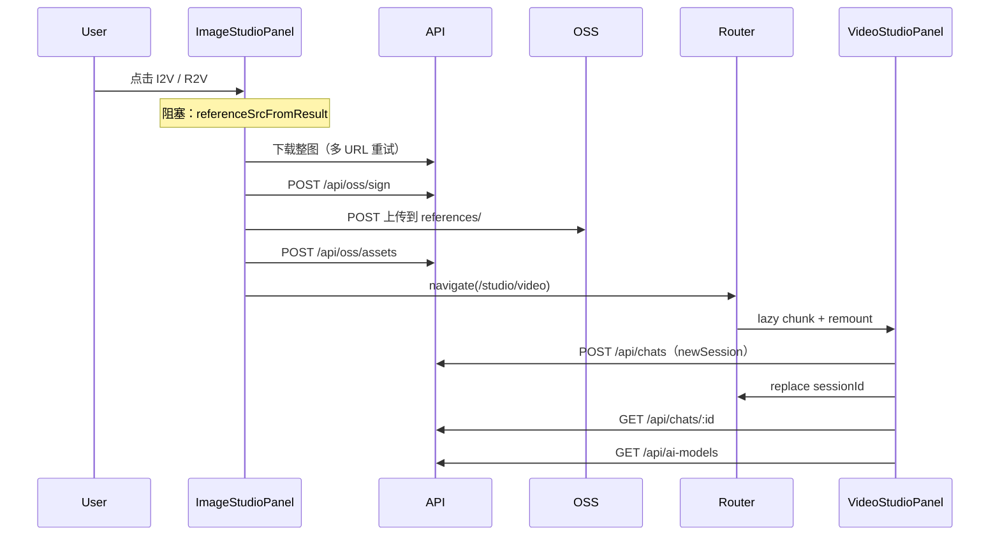

# 图片 Studio → 视频 Studio 跳转性能分析

本文档记录从**图片 AI 工作室**点击 **图生视频（I2V）** / **参考生视频（R2V）** 时响应慢的原因、验证方法与优化方案。与 [Dashboard 侧边栏切换性能分析](./Dashboard侧边栏切换性能分析.md) 中 Studio 懒加载、会话恢复等结论有关联。

---

## 1. 现象

- 在图片 Studio 预览区点击「AI 编辑」菜单中的 **图生视频** 或 **参考生视频** 后，页面长时间无反应，随后才进入视频 Studio。
- 图生 / 参考生走**同一条跳转链路**，体感延迟相近。
- 与图片本身在列表中的缩略图加载速度无直接关系——瓶颈在**跳转前/跳转时**的同步网络与路由挂载。

---

## 2. 跳转链路（优化前）

相关代码：

| 环节 | 文件 |
|------|------|
| 点击入口 | `preview-panels.tsx` → `onGenerateVideo("I2V" \| "R2V")` |
| 阻塞上传 | `-studio-image-panel.tsx` → `generateVideoFromResult` → `referenceSrcFromResult` |
| 下载 + 再上传 | `-studio-shared.tsx` → `fetchReferenceBlob` + `referenceSrcFromBlob` |
| 路由 / lazy | `-studio-panel.tsx`、`dashboard.studio.video.tsx` |
| 新建会话瀑布 | `-studio-shared.tsx` → `createNewSession` + `loadSessionDetail` |
| handoff 应用 | `-studio-video-panel.tsx` handoff effect |

---

## 3. 根因分析（按耗时排序）

### 3.1 跳转前：同步「下载整图 → 再上传 OSS」（P0，最大头）

`generateVideoFromResult` 在 `navigate` **之前** `await referenceSrcFromResult(result)`：

1. `fetchReferenceBlob` — 按 `referenceCandidates` 下载整张图  
2. `POST /api/oss/sign` — 获取上传凭证  
3. `POST` 到 OSS — 写入 `generations/references/`  
4. `POST /api/oss/assets` — 注册资源  

**即使生成结果已在 Megick OSS 上**，旧逻辑仍会 re-download + re-upload。大图可达数秒，且点击后**无 loading**，用户感觉「点了没反应」。

### 3.2 跳转后：懒加载 + 新建会话瀑布

- 双层 lazy：`dashboard.studio.video` → `StudioPage` → `VideoStudioPanel`
- `newSession: true` → `POST /api/chats` → 再次 `navigate(replace)` 写入 `sessionId` → `loadSessionDetail`
- 图片 / 视频为**独立路由**（`/studio/image` ↔ `/studio/video`），互切整页 remount，无法复用图片 Studio 已加载状态

### 3.3 其他叠加

| 因素 | 说明 |
|------|------|
| 无 chunk 预加载 | 侧边栏 `preload="intent"` 已移除（router 竞态），视频 chunk 常需首次下载 |
| URL 携带长 `sourceImage` | 若 fallback 为 data URL，search 参数极长 |
| handoff sessionStorage 键名错误（已修） | 视频页曾读 `megick-handoff:`，写入为 `megick-studio-handoff:` |

---

## 4. P0 优化（已实现）

**策略：已有 OSS / API 可复用 URL 时直接 handoff，先 `navigate`，仅在必要时于视频页后台 re-upload。**

### 4.1 `resolveVideoHandoffReference(result)`

位置：`apps/web/src/components/studio/panel/utils.ts`

逻辑：

1. 从 `result.src` / `sourceSrc` / `fallbackSrc` 及 job output URL 中选候选  
2. 若可解析为 OSS key（`generations/` 等）→ 转为 `/api/oss/sign?key=...`，**`ready: true`**  
3. 若已是同源 job content / sign URL → **`ready: true`**，直接 handoff  
4. 若为上游 provider URL（volces 等）或无法复用 → **`ready: false`**，handoff 携带 `referenceResult` 快照  

### 4.2 图片 Studio：先跳转

`-studio-image-panel.tsx` → `generateVideoFromResult`：

- 不再 `await referenceSrcFromResult` 后再 navigate  
- `writeStudioHandoff` 写入 `pendingReferenceUpload` + `referenceResult`（仅 `ready: false` 时）  
- `sourceImage` search 仅在 URL ≤ 1024 字符时写入  

### 4.3 视频 Studio：立即展示 + 后台补传

`-studio-video-panel.tsx` handoff effect：

- 使用 `readStudioHandoff(handoffId)`（修正 sessionStorage 前缀）  
- 先用 handoff `src` 填充 I2V/R2V 参考图  
- 若 `pendingReferenceUpload`，后台 `referenceSrcFromResult` 完成后替换 ref URL  

### 4.4 预期效果

| 场景 | 优化前 | 优化后 |
|------|--------|--------|
| 常规定稿（OSS / sign URL） | 下载 + 上传数秒后才跳转 | **立即跳转**，0 次多余上传 |
| 仅 provider 临时 URL | 同上 | 先跳转，视频页后台上传 |
| 用户体感 | 点击后长时间无反馈 | 点击后马上进入视频 Studio |

---

## 5. 验证方法

Chrome DevTools → **Network**：

1. 对**已有 OSS 的生成图**点 I2V：跳转前**不应**再出现 `POST /api/oss/sign` + OSS upload  
2. 跳转后应出现 video chunk、`POST /api/chats`、`GET /api/chats/:id`  
3. 对 legacy provider-only 图：跳转后视频页才出现 download + upload  

**Performance**：跳转前 Scripting/Network 空闲时间应明显缩短。

---

## 6. 后续优化（P1 / P2）

| 优先级 | 项 | 说明 |
|--------|-----|------|
| P1 | Studio 路由合并 layout | 图片 / 视频共用 shell，减少 remount（见 Dashboard 文档 P2） |
| P1 | idle / hover 预加载 `VideoStudioPanel` chunk | 缩短跳转后白屏 |
| P2 | `newSession` 合并为单次 navigate | 减少二次 replace |
| P2 | 生成提交时才要求 `generations/references/` 前缀 | 进一步减少 handoff 路径上的上传 |

---

## 7. 变更记录

| 日期 | 说明 |
|------|------|
| 2026-07-13 | 初稿：根因分析（阻塞 re-upload、lazy、会话瀑布） |
| 2026-07-13 | **P0 实现**：`resolveVideoHandoffReference`、先 navigate、视频页后台补传；修复 handoff `readStudioHandoff` 前缀 |
