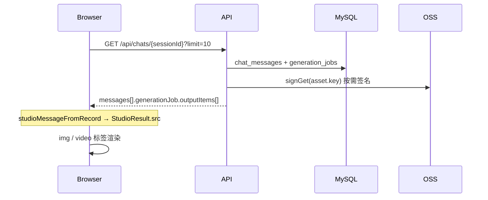

# 图片 / 视频加载链路与优化方案

> 状态：现状梳理 + 优化 backlog（2026-07-07）  
> 关联：[聊天查询优化方案](./聊天查询优化方案.md)、[Dashboard 侧边栏切换性能分析](./Dashboard侧边栏切换性能分析.md)

---

## 1. 背景

生产环境（`https://megick.abcyjw.me`）用户反馈：

- Studio 预览、历史条带、媒体中心加载慢
- 视频合并 / 下载频繁 `Failed to fetch` 或 `Video metadata failed to load`
- 控制台曾出现 dashscope OSS 的 CORS 报错（`credentials: include` + `Access-Control-Allow-Origin: *`）

根因不是单点，而是 **URL 策略不统一 + API 整包代理 + 公网带宽过小（约 2 Mbps）** 叠加。

---

## 2. 核心概念：三层地址

| 层级 | 存什么 | 谁用 |
|------|--------|------|
| **事实层（DB）** | `oss_assets.key`、`generation_jobs.output_asset_ids`、`media_center_items.oss_key` | 服务端 |
| **对外 URL（API 组装）** | 签名 OSS URL、API 代理路径、上游 provider URL | 返回给前端 |
| **浏览器展示** | `` / `<video src>` / `fetch()` blob | 用户端 |

**重要：** 数据库不存「最终可访问 URL」，每次列表/详情由 API 动态拼装。

### 2.1 API 代理路径（Megick 域名下）

| 路径 | 用途 |
|------|------|
| `GET /api/generation/jobs/{jobId}/output/{index}/content` | 按任务输出索引取二进制（图/视频） |
| `GET /api/generation/jobs/{jobId}/output/{index}/content?variant=thumbnail` | 图片缩略图 |
| `GET /api/generation/jobs/provider-output/{mediaId}/content` | 按 `media_center_items.id` 取图（含水印逻辑） |
| `GET /api/oss/assets/content?key=...` | 按 OSS key 直读（鉴权后） |
| `GET /api/oss/sign?key=...` | 返回签名 GET URL（前端 `directAssetSrc` 会改写部分路径） |

### 2.2 外部 URL

| 来源 | 示例 | 可控性 |
|------|------|--------|
| Megick OSS 签名 URL | `megick-studio` 桶 + 自定义域名 | 可配 CORS/CDN |
| BasicRouter / DashScope | `dashscope-*.oss-accelerate.aliyuncs.com/...` | **不可控** |

---

## 3. 图片加载链路

### 3.1 数据从哪来



会话内图片 `src` 组装逻辑（`apps/web/src/routes/-dashboard-types.ts`）：

1. 优先 `generationJob.outputItems[].url`（`studioResultsFromJob`）
2. 补充 `message.metadata.results`（合并编辑、上传等）
3. `withDirectAssetSrc` 将 `/api/oss/assets/content?key=` 转为 `/api/oss/sign?key=` 或保留原 URL

### 3.2 不同场景下的图片 URL 策略

| 场景 | API 返回的 `outputItems[].url` | 浏览器实际请求 |
|------|-------------------------------|----------------|
| **生成任务列表**（`jobs.service.toPublicJobListItem`） | 一律 API 代理 `/output/{i}/content` | 走 Megick API → OSS 读全量 → `res.send(buffer)` |
| **会话详情 / 任务详情**（`chats.service.toPublicJob`） | 免费用户：`/provider-output/{mediaId}/content`（水印）<br>付费用户：24h 签名 OSS URL | 免费：API 代理；付费：浏览器直连 OSS |
| **媒体中心列表**（`media-center.service`） | 一律 `/provider-output/{mediaId}/content` | API 代理（缩略图加 `?variant=thumbnail`） |
| **历史条带缩略图**（`preview-panels.historyStripPreviewSrc`） | `thumbnailSrc` → `jobOutputContentUrl(?variant=thumbnail)` | API 代理小图 |

### 3.3 API 代理读图时服务端做了什么

`jobs.service.getOutputContent` → `generation-output-media.service.getOutputContent`：

1. 校验 `userId` 与 job / mediaId 归属
2. `oss.getAuthorizedAssetContent`：**整文件读入 Node 内存**
3. 免费用户图片：叠加水印 process（OSS 图片样式或 fallback 文字水印）
4. `res.setHeader(Content-Length)` + `res.send(buffer)` — **非流式、无 Range**

### 3.4 图片前端展示

| 组件 | 行为 |
|------|------|
| `ImagePreviewPanel` / `PanZoomImage` | ``，可选 `fallbackSrc` |
| `ImageCanvasViewport` | 画布多图，`` |
| 历史条带 | 优先 `thumbnailSrc`，减小体积 |

---

## 4. 视频加载链路

### 4.1 生成落库

`image2video.processor` 完成后：

1. 尝试从 provider 下载视频字节 → `oss.putBuffer` 写入 `generations/{userId}/{jobId}/...`
2. 记录 `output_asset_ids`（Megick OSS）和/或 `provider_output_urls`（上游临时 URL）
3. 若 OSS 上传失败但 provider URL 存在，任务仍可 `succeeded`，**仅保留上游 URL**

### 4.2 会话 / 列表返回给前端的 URL

| 场景 | 视频 `outputItems[].url` | 说明 |
|------|--------------------------|------|
| **任务列表** | `/api/generation/jobs/{id}/output/0/content` | 轻量，不签名 |
| **会话详情**（`toPublicJob`） | 有 OSS 资产：`signGet` 24h 签名 URL<br>无 OSS：`provider_output_urls[i]`（dashscope 等） | **与列表不一致** |
| **媒体中心** | `/provider-output/{mediaId}/content` | 需先写入 `media_center_items` |

视频 **不会** 像免费图片那样强制走 `provider-output` 代理展示（`publicRefForAsset` 对非图片类型直接返回 `assetUrl`）。

### 4.3 浏览器播放

`VideoPreviewPanel`：

```tsx
<video src={result.src} preload="metadata" controls />
```

- `src` 为签名 OSS URL 时：浏览器 **直连 OSS/CDN**，可渐进缓冲
- `src` 为 API 代理时：每次播放 = API 从 OSS **整包读出再下发**，受 ECS 出口带宽限制
- `src` 仍为 dashscope URL 时：直连上游 OSS（预览通常可播；`fetch` 合并曾遇 CORS，见 §6）

### 4.4 API 代理读视频

`getOutputContent` 视频分支：

1. 有 `oss_assets`：`oss.getAuthorizedAssetContent` → 全量 buffer → `res.send`
2. 无资产仅有 `provider_output_urls`：`fetchExternalOutputContent` 服务端拉上游 → 全量 buffer → `res.send`

**不支持 `Accept-Ranges` / `206 Partial Content`**，无法高效拖拽进度条。

---

## 5. 下载 / 合并 / 剪辑时的加载链路

与「预览」不同，以下操作需要 **完整文件字节**：

| 操作 | 实现位置 | 加载方式 |
|------|----------|----------|
| 下载图片/视频 | `fetchMediaBlob` | 按 `downloadCandidates` 依次尝试 |
| 合并长视频 | `exportMergedVideo` | 每个视频 `fetchMediaBlob` → blob URL → Canvas + MediaRecorder |
| 轻量视频裁剪 | `exportEditedVideo` | 同上 |
| 剪辑器导出 | `SceneExporter`（mediabunny） | 本地 WASM 渲染，素材经 `session-media.fetchMediaBlob` |

### 5.1 `downloadCandidates` 优先级（`utils.ts`）

1. `/api/generation/jobs/{jobId}/output/{index}/content`
2. `/api/generation/jobs/provider-output/{mediaId}/content`
3. `/api/oss/assets/content?key=...`（从 `src` 解析）
4. `item.src` / `fallbackSrc` / `sourceSrc`（可能是签名 OSS 或 dashscope）

跨域 URL 使用 `credentials: omit`（commit `533958f`），避免 OSS `*` + cookie 的 CORS 失败。

### 5.2 合并结果回写

`appendMergedVideoToSession` 在 `studio-shared.tsx` **仍为空实现**，合并成功后 **不会自动上传回会话**。

---

## 6. 全链路示意图

```mermaid
flowchart TB
  subgraph Storage
    DB[(MySQL)]
    OSS[(megick-studio OSS)]
    PROV[上游 provider OSS]
  end

  subgraph API["NestJS API (ECS ~2Mbps)"]
    CHATS[/api/chats/]
    JOBS[/api/generation/jobs/.../content]
    PO[/provider-output/.../content]
    OSSAPI[/api/oss/...]
  end

  subgraph Browser
    IMG[img / video 标签]
    FETCH[fetch → blob]
    MERGE[Canvas 合并]
  end

  DB --> CHATS
  DB --> JOBS
  OSS --> JOBS
  PROV --> JOBS
  OSS --> PO

  CHATS -->|outputItems.url| IMG
  JOBS -->|整包 buffer| IMG
  JOBS -->|整包 buffer| FETCH
  OSS -->|签名 URL 直连| IMG
  PROV -->|直连 预览| IMG
  PROV -->|fetch omit| FETCH
  FETCH --> MERGE
```

---

## 7. 瓶颈归纳

| 编号 | 瓶颈 | 影响 |
|------|------|------|
| B1 | ECS 公网带宽 ~2 Mbps | 所有经 API 代理的媒体都慢；多视频合并成倍放大 |
| B2 | API **整包缓冲**转发（无 Stream / Range） | TTFB + 下载时间双高；无法边下边播（代理模式） |
| B3 | 视频 URL **策略分裂**（列表用代理、详情用签名 OSS） | 行为难预期；部分场景仍落回代理 |
| B4 | 上游 provider URL 落库 | 合并 fallback 到 dashscope；CORS/过期/不可控 |
| B5 | 合并 / 剪辑全在浏览器 | 需先完整下载；大文件易超时、metadata 失败 |
| B6 | `appendMergedVideoToSession` 未实现 | 合并产物无法持久化到会话 |
| B7 | 图片免费用户强制水印代理 | 必要但增加 API 负载（无法完全去掉） |

### 7.1 典型故障对应

| 用户现象 | 可能链路 |
|----------|----------|
| 预览慢但终能播 | API 代理或 2Mbps 限速 |
| 合并 `Failed to fetch` | 代理超时 / 404 / 网络中断 |
| 合并 `Video metadata failed to load` | 下载不完整或 blob 非合法 MP4 |
| dashscope CORS | `fetch` + `credentials:include` 打上游（已用 omit 缓解） |
| `output/1/content` 404 | `outputIndex` 与任务实际输出数不一致 |

---

## 8. 优化方案

### P0 — 运维与配置（不改架构，见效快）

| 项 | 动作 | 预期收益 |
|----|------|----------|
| P0-1 | ECS 公网带宽 2 Mbps → **≥10 Mbps**（建议 20 Mbps） | 代理下载/合并时间线性缩短 |
| P0-2 | Nginx `proxy_read_timeout` / `proxy_buffering` 调大（媒体 location ≥300s） | 减少大视频中途断开 |
| P0-3 | 确认生产已部署 **`533958f`**（跨域 fetch omit） | 消除 dashscope CORS |
| P0-4 | 开启 **HTTP/2** 或修复 `/api/*` 的 HTTP/2 协议错误 | 减少连接排队 |

### P1 — API 与 URL 策略（小改代码，收益高）

| 项 | 动作 | 说明 |
|----|------|------|
| P1-1 | **视频会话详情统一返回 API 代理或统一返回签名 OSS** | 避免同一任务在不同接口下 URL 类型不一致 |
| P1-2 | `GET .../content` 支持 **`Range` 请求** + `stream.pipeline` 流式转发 | 视频可拖拽、TTFB 降低；合并仍可走全量 GET |
| P1-3 | 视频 `outputItems` 增加 **`mediaId`**，前端展示统一走 `provider-output` 或签名 URL | 与媒体中心模型对齐 |
| P1-4 | 合并时 **同源 URL 直接用 `<video src>`**，跳过 `fetch` 整包 | 减少内存与重复下载 |
| P1-5 | 实现 **`appendMergedVideoToSession`**（`POST /api/chats/.../media-results`） | 合并结果可保存 |
| P1-6 | `fetchMediaBlob` 校验 `Content-Length` / MP4 `ftyp` | 失败时提示「下载不完整」而非 metadata 模糊错误 |

### P2 — 架构升级（中等工作量）

| 项 | 动作 | 说明 |
|----|------|------|
| P2-1 | 展示用 **302 到短期签名 OSS URL**（鉴权后 redirect） | 浏览器直连 OSS/CDN，API 不再扛流量 |
| P2-2 | OSS 前置 **CDN**（回源 megick-studio）+ CORS 配 `https://megick.abcyjw.me` | 静态加速；勿用 `*` 若需带 cookie |
| P2-3 | 生成完成时 **强制落 Megick OSS**，弱化 `provider_output_urls` 对外暴露 | 消除 dashscope 依赖 |
| P2-4 | 图片列表缩略图 **OSS 样式预生成** 或 CDN 缓存 | 减轻 API 水印实时计算 |
| P2-5 | 视频合并改 **服务端 ffmpeg concat**（BullMQ worker） | 绕开浏览器带宽与编解码限制 |

### P3 — 产品 / 长期

| 项 | 说明 |
|----|------|
| P3-1 | 图片画布「合并导出」补齐实现（当前仅 UI） |
| P3-2 | 剪辑器大工程素材 **分片上传 / 渐进加载** |
| P3-3 | 媒体中心与 Studio 共用 **单一 clientUrl 事实源**（`media_center_items` 已有方向） |

---

## 9. 推荐落地顺序

```
P0 带宽 + Nginx 超时
  → P1-2 Range 流式代理
  → P1-4 / P1-5 合并体验
  → P2-1 302 签名直链（展示）
  → P2-5 服务端合并（可选）
```

---

## 10. 关键代码索引

| 模块 | 路径 |
|------|------|
| URL 组装（列表 vs 详情） | `apps/api/src/modules/generation/generation-output-urls.ts` |
| 任务输出读取 | `apps/api/src/modules/generation/jobs.service.ts` → `getOutputRedirectUrl`（OSS 302；无 OSS 时 controller 流式回退） |
| 水印 / provider-output | `apps/api/src/modules/generation-output-media/generation-output-media.service.ts` |
| 会话 job 公开化 | `apps/api/src/modules/chats/chats.service.ts` → `toPublicJob` |
| 媒体中心列表 URL | `apps/api/src/modules/media-center/media-center.service.ts` |
| 前端 StudioResult | `apps/web/src/routes/-dashboard-types.ts` |
| 下载候选 / fetch | `apps/web/src/components/studio/panel/utils.ts` |
| 预览组件 | `apps/web/src/components/studio/panel/preview-panels.tsx` |
| 视频合并 | `apps/web/src/components/studio/panel/video-media-center.tsx` |
| OSS 读对象 | `apps/api/src/modules/oss/oss.service.ts` → `getAuthorizedAssetContent` |

---

## 11. 变更记录

| 日期 | 说明 |
|------|------|
| 2026-07-07 | 初版：梳理图片/视频加载链路、瓶颈与 P0–P3 优化 backlog |
| 2026-07-07 | 前端 `533958f`：跨域 `fetch` 使用 `credentials: omit` |
| 2026-07-13 | **P2-1 / P2-3 实现**：`GET .../content` 改为 302 签名 OSS；详情/媒体中心优先返回缓存签名 URL；生成任务强制落 Megick OSS（失败即 job 失败） |
| | **CDN**：沿用 `OSS_DOMAIN` / `rewriteOssUrl`（运维配置自定义域名 + CDN 回源，无代码变更） |
| 2026-07-13 | **合并下载修复**：`GET .../output/{index}/content` 有 OSS 时 302，仅 provider URL 时回退 API 流式（兼容历史任务；前端合并 `fetchMediaBlob` 无需改） |
| 2026-07-13 | **index 对齐**：API `orderedAssetSlots` 保留 `outputAssetIds` 下标；前端 fallback 结果不再误绑 `outputIndex`；下载候选跳过 volces 直链优先走 API |
