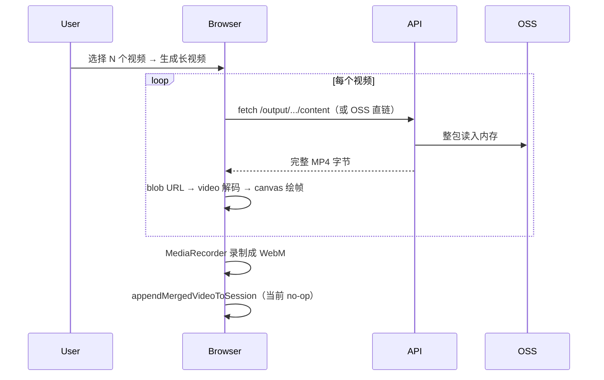
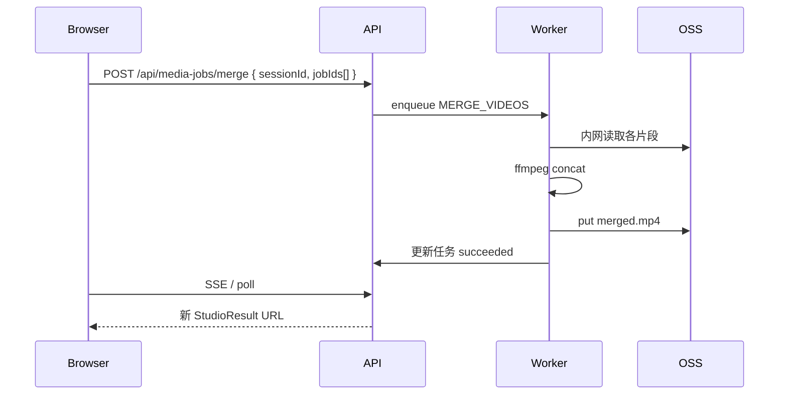

# 浏览器端图片 / 视频合并与剪辑：缺点与优化方案

> 状态：现状分析 + 改造 backlog（2026-07-07）  
> 关联：[图片视频加载链路与优化方案](./图片视频加载链路与优化方案.md)

---

## 1. 范围说明

本文讨论 **Megick Studio 内由浏览器完成合成/导出** 的能力，不含 AI 生成（服务端 Worker + BasicRouter）。

| 能力 | 实现状态 | 技术栈 | 代码入口 |
|------|----------|--------|----------|
| **视频合并（生成长视频）** | 已上线 | `fetch` 全量下载 → `<video>` 播放 → Canvas 绘帧 → `MediaRecorder` 录 WebM | `video-media-center.tsx` → `exportMergedVideo` |
| **视频轻量剪辑**（裁剪/变速/裁切） | 已上线 | 同上 | `video-media-center.tsx` → `exportEditedVideo` |
| **Megick 剪辑器导出** | 已上线 | WASM 渲染 + `mediabunny` 逐帧编码 MP4/WebM | `scene-exporter.ts` → `SceneExporter` |
| **图片画布合并导出** | **仅 UI，未实现** | 菜单有「合并导出」，无 `onClick` 逻辑 | `ImageStudioWorkspace.tsx` |
| **图片画布逐张导出** | **仅 UI，未实现** | 同上 | 同上 |

剪辑器 **工程数据** 存浏览器 IndexedDB，**不经过服务端**；合并产物已通过 `appendMergedVideoToSession` 上传至 OSS 并写入会话消息。

---

## 2. 浏览器方案的工作原理（简述）

### 2.1 视频合并



### 2.2 剪辑器导出

1. 素材经 `fetchMediaBlob` 下载到本地（IndexedDB / 内存）
2. `CanvasRenderer` 按时间轴逐帧渲染
3. `mediabunny` 编码为 MP4（H.264）或 WebM（VP9）
4. 可选 `saveExportBackToSession` 上传回服务端 OSS

### 2.3 图片合并（规划态）

画布已支持多图排版（`useImageCanvasState`），导出合并预期为 **Canvas `toBlob` / 多图合成一张 PNG**，仍在浏览器完成。

---

## 3. 主要缺点

### 3.1 性能与带宽

| 缺点 | 说明 |
|------|------|
| **双重流量** | 合并前每个视频需从 API/OSS **完整下载**到浏览器；合并后若上传回会话再占一次上行带宽 |
| **受用户网络与 ECS 出口双重限制** | 素材经 `/api/.../content` 代理时，受生产机 ~2 Mbps 带宽影响；用户本地网络差时更易失败 |
| **内存峰值高** | N 个视频依次进内存；剪辑器导出时整片 `AudioBuffer` + 帧缓冲 + 编码缓冲同时存在 |
| **CPU 密集** | Canvas 逐帧绘制 + `MediaRecorder` / `mediabunny` 软编码，笔记本风扇狂转、页面卡顿 |
| **无法并行利用服务端算力** | 多用户同时合并/导出，压力全在用户设备，服务端只承担代理读文件 |

### 3.2 可靠性与错误处理

| 缺点 | 说明 |
|------|------|
| **下载不完整即失败** | 半截 MP4 导致 `Video metadata failed to load`，错误信息对用户不友好 |
| **无断点续传** | `fetch` 一次拉全量，超时/断网需从头再来 |
| **URL 来源复杂** | `downloadCandidates` 多级 fallback（API → provider-output → OSS → dashscope），任一级异常都难排查 |
| **合并结果未持久化** | `appendMergedVideoToSession` 未实现，合并成功也无法自动进会话历史 |
| **标签页关闭即丢失** | 剪辑器工程在 IndexedDB，清缓存/换设备无法恢复（产品设计如此，但用户易误解） |

### 3.3 画质与格式

| 缺点 | 说明 |
|------|------|
| **二次有损编码** | 合并走 `MediaRecorder` 输出 **WebM（VP8/VP9）**，相对源 MP4（H.264）多一代压缩 |
| **无精确时间轴拼接** | 实时播放 + 录屏式合并，依赖 `requestAnimationFrame`，边界帧可能丢/重复 |
| **音频处理弱** | 会话内合并路径 **默认静音**（`video.muted = true`），不保留原视频音轨 |
| **编码器因浏览器而异** | Safari / 移动端 `MediaRecorder` 支持度不一致；H.265 源视频在部分浏览器无法解码 |
| **分辨率上限** | 合并逻辑 `exportScale` 最大宽 1920，超清源会被缩小 |

### 3.4 体验与产品

| 缺点 | 说明 |
|------|------|
| **长时间无进度细节** | 合并只有「正在合并…」，不展示「下载 2/4」「编码 35%」 |
| **大图/长视频易假死** | 主线程繁忙，UI 响应差 |
| **移动端几乎不可用** | 内存、编码能力、后台标签节流 |
| **图片合并导出未交付** | 用户看到「合并导出」菜单但无法使用 |

### 3.5 安全与合规

| 缺点 | 说明 |
|------|------|
| **素材暴露在客户端** | 全量下载到用户机器，无法控制下载后留存（企业合规场景不利） |
| **水印绕过风险** | 若展示走代理水印、合并走未加水印 fallback URL，存在策略不一致风险（需审计 `downloadCandidates` 顺序） |

### 3.6 运维与可观测性

| 缺点 | 说明 |
|------|------|
| **失败难监控** | 合并失败只在前端 toast，服务端无任务 ID、无日志聚合 |
| **无法排队限流** | 不像生成任务有 BullMQ；大量用户同时导出无法后台调度 |

---

## 4. 与「服务端处理」对比

| 维度 | 浏览器合并（现状） | 服务端 ffmpeg / 媒体 worker（目标态） |
|------|-------------------|--------------------------------------|
| 首次等待 | 先下载全部素材再编码 | 服务端 OSS 内网读，通常更快 |
| 用户带宽 | 消耗大（下行 N 次 + 可选上行） | 仅预览/下载成品 |
| 内存占用 | 用户设备 | 服务器（可水平扩展） |
| 输出格式 | 多为 WebM | 统一 MP4 + 规范参数 |
| 音轨 | 易丢失 | concat / filter 可保留 |
| 进度与重试 | 弱 | 任务队列 + SSE 进度 |
| 成本模型 | 算力在用户侧 | 占用 ECS/GPU 与 OSS 流量 |

---

## 5. 优化方案

### 5.1 短期（保留浏览器方案，降失败率）— P1

| 编号 | 方案 | 工作量 | 说明 |
|------|------|--------|------|
| P1-1 | **实现 `appendMergedVideoToSession`** | 小 | 调用已有 `POST /api/chats/{id}/media-results`，合并 WebM 上传 OSS 并写入 metadata |
| P1-2 | **合并进度分阶段** | 小 | UI 显示「下载 i/N」「编码中 xx%」；`exportMergedVideo` 增加回调 |
| P1-3 | **Blob 校验** | 小 | 检查 `size`、`Content-Type`、MP4 `ftyp`；失败提示「下载不完整，请重试」 |
| P1-4 | **同源视频直链加载** | 中 | 对 `/api/.../content` 用 `<video src>` 流式解码，跳过 `fetch` 整包（仍须解决 canvas 跨域污染：同源无此问题） |
| P1-5 | **合并输出改 MP4** | 中 | 会话内合并复用 `mediabunny`（与剪辑器同栈），替代 `MediaRecorder` WebM |
| P1-6 | **可选保留音轨** | 中 | 合并时 `muted: false` + `captureStream` 混音，或明确产品决策「合并默认无声」并改文案 |
| P1-7 | **图片画布合并导出 MVP** | 中 | `Canvas.toBlob('image/png')` 合成选中图层，上传或本地下载 |

### 5.2 中期（减轻浏览器负担）— P2

| 编号 | 方案 | 工作量 | 说明 |
|------|------|--------|------|
| P2-1 | **展示/下载分离** | 中 | 预览走 302 签名 OSS + CDN；仅合并/导出走 API 或服务端任务（见加载链路文档 P2-1） |
| P2-2 | **Range 流式代理** | 中 | API 支持 `Range`，浏览器 `fetch` 分段拉取，降低单次失败面 |
| P2-3 | **Web Worker 编码** | 大 | 将 `exportMergedVideo` / `SceneExporter` 帧循环移入 Worker，避免 UI 卡死 |
| P2-4 | **剪辑器素材按需流式加载** | 大 | 时间轴只解码当前窗口内片段，不全量 `fetchMediaBlob` |
| P2-5 | **强制视频落 Megick OSS** | 中 | 生成完成禁止仅留 dashscope URL，合并不再依赖不可控上游 |

### 5.3 长期（服务端合成）— P3

| 编号 | 方案 | 工作量 | 说明 |
|------|------|--------|------|
| P3-1 | **服务端视频 concat 任务** | 大 | 新 BullMQ job：`MERGE_VIDEOS`；ffmpeg `-f concat -c copy`（同编码）或重编码；输入输出均走 OSS |
| P3-2 | **服务端图片拼版** | 中 | 接收布局 JSON + assetId 列表；`sharp` / ImageMagick 合成；适合 2K/4K 导出 |
| P3-3 | **统一「媒体处理」模块** | 大 | 合并、裁剪、转码、水印共用任务表；前端只提交参数 + 轮询/SSE |
| P3-4 | **剪辑器云导出（可选）** | 很大 | 时间轴 JSON 上传服务端渲染；仅对付费或长片开放 |

#### P3-1 服务端合并示意



**优点：** 不占用户带宽、格式统一、可记录日志与重试、与生成任务体验一致。  
**成本：** 需 ffmpeg 镜像、磁盘临时空间、任务监控；异编码源需重编码更慢。

---

## 6. 推荐路线

```
阶段 A（1–2 周）
  P1-1 合并回写会话
  P1-2 / P1-3 进度与校验
  + 运维：提升 ECS 带宽（加载链路 P0）

阶段 B（2–4 周）
  P1-4 / P1-5 合并体验与格式
  P1-7 图片合并导出 MVP
  P2-5 视频统一落 OSS

阶段 C（按需）
  P3-1 服务端视频合并（用户量大或视频变长时优先）
  P3-2 服务端图片拼版（2K/4K 导出需求明确时）
```

**原则：**

- **短视频、少片段、快速迭代**：浏览器方案 + P1 修补即可。
- **长视频、多片段、要进会话历史、要 MP4 质量**：尽快上 P3-1。
- **图片合并**：实现简单，可先做 P1-7；高分辨率走 P3-2。

---

## 7. 决策备忘

| 问题 | 建议 |
|------|------|
| 合并是否保留音轨？ | 产品定：默认保留更合理；当前实现为静音，需改代码或改文案 |
| 合并输出格式？ | 对外统一 **MP4 H.264**；WebM 仅作浏览器过渡 |
| 是否下线浏览器合并？ | 不建议立刻下线；服务端就绪后作为「高质量合并」选项，浏览器作 fallback |
| 图片画布与视频合并是否同一套任务系统？ | 长期是，统一 `media_jobs` 表与进度 UI |

---

## 8. 关键代码索引

| 模块 | 路径 |
|------|------|
| 视频合并 / 轻量剪辑 | `apps/web/src/components/studio/panel/video-media-center.tsx` |
| 合并弹窗 | `apps/web/src/components/studio/panel/media-center-dialog.tsx` |
| 合并回写（空实现） | `apps/web/src/routes/-studio-shared.tsx` → `appendMergedVideoToSession` |
| 剪辑器导出 | `apps/web/src/megickcut/services/renderer/scene-exporter.ts` |
| 导出回写会话 | `apps/web/src/megickcut/integration/session-media.ts` → `saveExportBackToSession` |
| 图片画布（导出未接） | `apps/web/src/components/studio/canvas/ImageStudioWorkspace.tsx` |
| 媒体下载候选 | `apps/web/src/components/studio/panel/utils.ts` → `downloadCandidates` |
| 上传合并结果 API | `apps/api/src/modules/chats/chats.controller.ts` → `appendMediaResult` |

---

## 9. 变更记录

| 日期 | 说明 |
|------|------|
| 2026-07-07 | 初版：浏览器合并/剪辑缺点梳理与 P1–P3 优化路线 |
