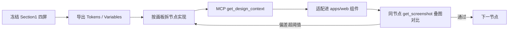

# MagiCoreAI UI 改版方案

> 状态：Phase 4 完成 · 待 Phase 5（剪辑壳层）  
> **硬约束：只换 UI，禁止改动后台 / API**  
> **Phase 0 锁定：品牌 B + 次要入口收进「更多」**  
> 分支建议：`v0.0.2-ui_design-20260729`  
> 设计稿：[MegiCoreAI · Page 1 / Section 1](https://www.figma.com/design/A8pVy0Wd7vLufWQdKqu9wB/MegiCoreAI?node-id=63-43)  
> 文件 Key：`A8pVy0Wd7vLufWQdKqu9wB`  
> 编写日期：2026-07-30  
> 修订：2026-07-30 — Phase 4 图像/视频壳层落地

---

## 0. 硬约束：只换 UI，不动后台

本改版 **仅允许** 修改前端表现层，**禁止** 任何后端与协议层改动。

### 0.1 允许改动的目录

| 允许 | 路径 |
|------|------|
| ✅ | `apps/web/**`（路由壳、组件、样式、locale、静态资源） |
| ✅ | 可选：`apps/desktop` 若仅跟 Web 壳层样式同源且必要（默认不做） |

### 0.2 禁止改动的目录 / 范围

| 禁止 | 路径 / 范围 |
|------|-------------|
| ❌ | `apps/api/**`（Nest 控制器、Service、Processor、Adapter） |
| ❌ | `apps/api/prisma/**`、数据库迁移、种子数据 |
| ❌ | 生成协议 / BasicRouter / 上游模型适配、错误码映射后端逻辑 |
| ❌ | 计费、积分扣减规则、鉴权与限流后端逻辑 |
| ❌ | 为 UI 新增或修改 REST / WebSocket / 任务字段 |
| ❌ | Admin 管理端 API 与后台页面（除非另开需求） |

### 0.3 前端适配原则（无新 API）

- **只重组布局、样式、导航、文案、静态资源**；业务仍调用 **现有** 前端 client / hooks。
- 灵感池「生成 / 做同款」= 跳转现有工作室路由，或复用现有创建 job / 模板接口；**不发明新 endpoint**。
- 设计稿有、后端没有的能力（如「发布作品」、运营 Banner CMS、首尾帧双槽若依赖后端改约束）→ **UI 隐藏、占位或 toast「即将上线」**，不倒逼改 API。
- 模型列表、积分余额、历史记录等数据 **只读现有接口字段**；缺字段则不展示或写死静态运营图。
- PR 审查门禁：diff 不得出现 `apps/api`、`prisma` 等后台路径。

---

## 0.5 如何保障尽量 1:1 还原 Figma

> 结论先说：**没有「一次生成就永久 1:1」的魔法**；可靠做法是「冻结稿 → 按节点取数 → 组件对照实现 → 截图叠图验收」，并把 **1:1 的范围与误差** 写进验收。

### 0.5.1 先定义什么叫「1:1」（建议写进验收）

| 层级 | 要求 | 建议误差 |
|------|------|----------|
| **壳层布局** | 侧栏宽、主区分区、灵感池四段顺序与稿一致 | 关键间距 ±2px；整页宽按 1920 基准 |
| **组件几何** | 按钮高、圆角、图标盒、创作条高度 | ±1～2px |
| **颜色 / 字重** | 用 Variables / 导出色值，禁止目测挑色 | 与 Variables 一致（允许 OKLCH 换算误差） |
| **资产** | Logo、Banner、图标用 Figma 导出原件 | 禁止手绘替代 / emoji 顶替 |
| **动态区** | 瀑布流图、模型名、积分数字 | **结构 1:1，内容用真实数据**（允许图不同） |
| **响应式** | 稿为 1920；&lt;1280 / 移动另定规则 | 不宣称与 1920 稿像素级相同 |

不做虚假承诺的部分：系统字体回退、浏览器亚像素、滚动条、真实内容长短导致的换行——这些只能「观感一致」，不能数学上像素锁死。

### 0.5.2 工程流程（实现时强制）



1. **冻结设计**  
   - 以当前文件 `A8pVy0Wd7vLufWQdKqu9wB` Section 1 为唯一真理源；改稿需改版本号 / 更新日期。  
   - 实现前对四个根画板各留一张基准截图（本地 `docs/ui/baselines/`，可选）。

2. **先 Tokens，后组件**  
   - `get_variable_defs` + Dev Mode 量侧栏宽（78）、圆角、主色、字号行高 → 写入 `styles.css`。  
   - 禁止组件里散落魔法数字；间距用 token / 固定 spacing scale。

3. **按节点实现，禁止整页瞎猜**  
   - 每个可交付单元对应明确 `node-id`（如灵感池 `63:44`，再下钻 `sidebar` / `imageCreate` / `banner`）。  
   - 实现前对该节点调用 Figma MCP **`get_design_context`**（参考代码 + 标注），再适配到本仓库 React + Tailwind v4，**禁止整页粘贴 MCP 生成代码**。  
   - 图标 / 图：用 `download_assets` 或导出 PNG/SVG **落库**（远程 MCP URL ~7 天过期）。

4. **叠图验收（核心保障）**  
   - 同节点再拉 `get_screenshot`；浏览器实现页同视口截图。  
   - 用半透明叠图或 Pixel diff（Figma / 设计工具 / 简单对比脚本均可）。  
   - **偏差超 §0.5.1 阈值 → 打回改，不进下一 Phase。**

5. **分屏门禁（与 Phase 对齐）**  

| 门禁 | 节点 | 通过条件 |
|------|------|----------|
| M1 | 侧栏实例 | 宽、图标位、选中态、底栏四件套对齐 |
| M2 | 灵感池 `63:44` | 四段结构 + 创作条 + Banner + 瀑布流几何 |
| M3 | 图像 `76:1113` | 顶栏标题区 + 右上按钮组 + 主区边距 |
| M4 | 视频 `77:1512` | 同 M3 |
| M5 | 剪辑 `77:1612` | 壳层对齐；编辑器内部不强制像素 1:1 |

6. **席位与取数（已更新）**  
   - **文件侧**：已可进 **Dev Mode（Inspect）** — 实现时以 Inspect 红线 / CSS / Variables 为准，叠图对照。  
   - **MCP 账号**（`whoami`，2026-07-30）：当前仍报 `seat: View` / `tier: starter`。View 席位对 MCP 拉稿有较严速率限制；实现期仍建议 **关键切图与四屏基准图落本地**，避免额度打满中断。  
   - 若团队后续升到 Full / Dev 席位，可提高 MCP 调用频率；流程仍以「按节点 + 叠图」为准，不省略验收。

### 0.5.3 人员分工（建议）

| 角色 | 职责 |
|------|------|
| 设计 | 冻结稿、Variables、标注交互态（hover/选中）；改稿同步 node 与版本 |
| 前端 | 按节点实现 + 叠图自测；PR 附「实现截图 vs Figma 截图」 |
| 产品 / 设计验收 | 按 M1～M5 点检；动态内容只验结构 |

### 0.5.4 做不到「绝对 1:1」时的处理

- 稿有能力、现网无 API → 按 §0.3 **隐藏/降级**，并在验收单注明「非视觉偏差，是范围裁剪」。  
- 稿为整页位图占位（图像/视频/剪辑主区）→ **只验壳层**，主区内嵌现网 Studio，不宣称内部控件 1:1。  
- 字体未授权 → 选视觉最接近的已授权替代，并在方案附录记录「字体替代表」。

### 0.5.5 PR 必备附件（保障可审计）

每个 UI PR 描述中附：

1. Figma 链接 + `node-id`  
2. 实现页截图（1920 宽）  
3. 同节点 Figma 截图  
4. 已知差异列表（若有）  

无以上四项，不合并。

---

## 1. 目标与范围

### 1.1 目标

将现有 **Megick Studio** Web 端（`apps/web`）的视觉与主要信息架构，对齐 Figma **MagiCoreAI / 魔核** 设计稿：窄侧栏创作台 + 灵感发现首页 + 图像 / 视频 / 剪辑功能页。  
**能力集合与现网一致，只换皮与信息架构，不扩后端能力。**

### 1.2 本期范围（In）

| 范围 | 说明 |
|------|------|
| 设计 Token / 主题 | 颜色、圆角、字体、侧栏尺寸、暗色主视觉 |
| Dashboard 壳层 | 侧栏 IA、顶栏按钮区、品牌露出 |
| 灵感池 | 对应设计稿 `灵感池`（`63:44`），用现有模板/工作室能力拼出发现首页 |
| 图像 / 视频工作室壳层 | 标题区、右上操作、主工作区布局对齐设计稿 `图像` / `视频` |
| 剪辑入口壳层 | 对齐设计稿 `剪辑`（`77:1612`），先壳层再深层 MegickCut |

### 1.3 明确不做（Out / 延后）

| 延后项 | 原因 |
|--------|------|
| **一切后台 / API / DB 改动** | 硬约束（见 §0） |
| Admin 后台改版 | 设计稿未覆盖；且属另一面 |
| 官网营销页（`OfficialHomePageRich`）像素级重做 | 可与灵感池分阶段；避免与登录漏斗纠缠 |
| MegickCut 时间线 / 素材面板深度重绘 | 设计稿当前多为整页占位图；先壳层 |
| 依赖后端的新功能（发布作品、首尾帧约束放开等） | 另立需求；本期 UI 可隐藏 |
| 多语言文案全量替换为「魔核」 | 需产品确认品牌切换策略后再批量改 locale |

### 1.4 成功标准

1. 登录后主路径视觉与 Figma Section 1 四屏一致：**窄侧栏 + 四大入口**。
2. 灵感池首屏可读作「品牌 + 创作入口 + 发现流」，而非旧版仪表盘堆叠。
3. 图像 / 视频工作室在壳层上可辨认为 MagiCoreAI 布局；**现有生成能力不回退**（仍走原 API）。
4. 暗色主题为默认；不引入与稿面冲突的通用紫渐变 / 奶油风。
5. **PR 仅含 `apps/web`（及约定静态资源）**，可独立合入 `v0.0.2-ui_design-20260729`；**零 `apps/api` diff**。

---

## 2. 设计稿解读

### 2.1 画板结构（Page 1 → Section 1）

| 画板 | Node ID | 尺寸（约） | 产品映射 |
|------|---------|------------|----------|
| 灵感池 | `63:44` | 1920 × 1845 | 发现 / 模板 / 快捷创作首页 |
| 图像 | `76:1113` | 1920 × 1288 | 图像工作室 |
| 视频 | `77:1512` | 1920 × 1153 | 视频工作室 |
| 剪辑 | `77:1612` | 1920 × 1176 | 视频剪辑（MegickCut） |

共用组件：`sidebar`（宽约 **78px**）、右上 `button` 组（登录态操作）、各页标题 + 副标题。

### 2.2 侧栏信息架构（目标）

设计稿侧栏为 **图标主导、极窄**：

1. 灵感库 / 灵感池（选中态浅色高亮）
2. 图像
3. 视频
4. 剪辑  

底部区（设计稿）：积分 / 余额、头像、通知、更多。

与现网差异：现网 `-dashboard-shell.tsx` 侧栏更宽、入口更多（媒体库、历史、聊天、资料等）。改版需 **折叠次要入口**（收入「更多」或二级页），避免首屏侧栏膨胀。

### 2.3 灵感池（`63:44`）结构分层

自上而下建议实现为 4 个区块（与稿一致）：

1. **品牌头**  
   - Logo 图 `img-magicoreai` + 标语「让你的灵感变成作品」  
   - 副文案「描述你的创意，即刻为你实现」
2. **中央创作条**（`imageCreate`）  
   - 参考图「+」、提示词输入、风格 / 比例 / 模型、主 CTA「生成」  
   - 下方模型快捷条：Seedream 5.0、GPT Image 2、Image 4 Standard、Kling、QWen、Wan 等（数据源仍走现有 AI Models，不写死厂商名到业务逻辑）
3. **运营 Banner**（双卡：`banner-1` / `banner-2`）  
   - 可配置位；无运营配置时隐藏或占位
4. **发现流**  
   - 类型 Tab：全部 / 图片 / 视频  
   - 搜索 +「发布作品」  
   - 分类条：穿搭配色、品牌设计、海报与广告…  
   - 瀑布流卡片（`img-template`）+「做同款」

### 2.4 图像 / 视频 / 剪辑页共性

- 左：同一窄侧栏  
- 顶左：标题 + 一行副标题（如「生成和微调图片」「用提示词和图片生成视频」「编辑和修剪你的视频」）  
- 顶右：操作按钮组（约 110 + 96）  
- 主体：大内容区（设计稿现为整页图片占位；实现时嵌入现有 Studio / MegickCut 内容）

### 2.5 品牌与文案

| 设计稿 | 现网 |
|--------|------|
| MagiCoreAI / 魔核 | Megick / Megick Studio |
| 灵感池 | Template Center / Overview，无「灵感」命名 |

**Phase 0 已锁定（2026-07-30）：**

| 项 | 决策 |
|----|------|
| 品牌 | **B** — 包名仍 `@megick/*`，**仅 UI 显示 MagiCoreAI**（Logo / 可见文案）；SEO/邮件可后续跟进 |
| 次要导航 | 历史 / 媒体库 / 聊天 / 资料等 **收进侧栏「更多」**，主栏只保留四入口（灵感池 / 图像 / 视频 / 剪辑） |

（A 全面换品牌、C 配置开关 — 本期不做。）

---

## 3. 现网对照（Gap）

### 3.1 路由与壳层

| 能力 | 现网路径 / 文件 | 设计稿 | Gap |
|------|-----------------|--------|-----|
| Dashboard 壳 | `/dashboard` → `-dashboard-shell.tsx` | 窄侧栏四入口 | 侧栏宽、入口多、品牌不同 |
| 图像工作室 | `/dashboard/studio/image` | 图像 `76:1113` | 壳层标题区 / 布局需对齐 |
| 视频工作室 | `/dashboard/studio/video` | 视频 `77:1512` | 同上 |
| 模板中心 | `/dashboard/template` | 灵感池发现流 | 缺中央创作条 + Banner + 瀑布流 IA |
| 剪辑 | `/dashboard/video-editor`、`/editor/$sessionId` | 剪辑 `77:1612` | 壳层未对齐；编辑器内部延后 |
| 首页 | `/` OfficialHomePageRich | 未在 Section 1 | 本期可不改或只改入口跳转 |

### 3.2 Token / 主题

- 现网：`apps/web/src/styles.css`（Tailwind v4 + OKLCH「dark solar gold」）、`lib/theme.tsx`（默认 dark）  
- 设计稿：深灰底、亮蓝主 CTA、极窄侧栏选中浅色  
- Gap：主色从「金」系迁到稿面蓝强调；侧栏宽度 token（约 78px）；字体避免继续依赖 Inter 默认观感（需与稿面字体一致或接近）

### 3.3 组件复用

| 设计元素 | 可复用现网 | 新建 / 大改 |
|----------|------------|-------------|
| Sidebar | `-dashboard-shell.tsx`、`components/ui/sidebar.tsx` | 缩窄 + 四主入口 + 底部区 |
| Studio 面板 | `components/studio/panel/*`、`-studio-panel.tsx` | 顶栏标题区外壳 |
| 模板卡片 | Template Center 卡片 | 瀑布流 +「做同款」交互 |
| 创作条 | `StudioPromptComposer` 等 | 灵感池中央条为独立组合，可抽共享 composer |
| Banner | 无 | 新运营位组件 |
| MegickCut | `megickcut/integration/editor-shell.tsx` | 仅外壳；内部延后 |

---

## 4. 目标信息架构

```
登录后默认落地 → /dashboard/inspiration（灵感池，新建）
                 │
                 ├─ 侧栏：灵感池
                 ├─ 侧栏：图像 → /dashboard/studio/image
                 ├─ 侧栏：视频 → /dashboard/studio/video
                 └─ 侧栏：剪辑 → /dashboard/video-editor（或现有 editor 流）

次要入口（历史 / 媒体库 / 聊天 / 资料 / 设置）
  → 侧栏「更多」抽屉 / 用户菜单 / 独立路由（不占主四格）
```

路由命名建议（实现时可微调，但需一次定稿）：

| 建议 path | 说明 |
|-----------|------|
| `/dashboard/inspiration` | 灵感池（主落地） |
| `/dashboard/studio/image` | 保持 |
| `/dashboard/studio/video` | 保持 |
| `/dashboard/video-editor` | 保持 |
| `/dashboard/template` | 可 301/redirect → inspiration，或 inspiration 内复用 template API |

默认重定向：现网 `dashboard.index` → studio/image；改为 → **inspiration**。

---

## 5. 分阶段实施计划

### Phase 0 — 对齐与冻结（0.5～1 天）

- [x] 产品确认品牌策略（§2.5）→ **B**  
- [x] 确认次要导航收纳规则 → **收进「更多」**  
- [ ] 从 Figma 导出：Logo、侧栏图标、Banner 切图（Phase 2 前补齐）  
- [x] 冻结 Section 1 四屏为「壳层验收基准」；图像/视频/剪辑内部若仍是占位图，验收以壳层为准  
- [x] Figma Variables 已取样（灵感池）：Primary `#57d9fa`、Card `#151619`、Hover `#101114`、Border `#26282b`、Placeholder `#6e7279`

**交付物：** 本文档决策锁定；Token 见 Phase 1

### Phase 1 — Design Tokens（1～2 天）

- [x] 在 `styles.css` 增加 / 调整 CSS 变量：`--dashboard-rail-width`（78px）、主 CTA 蓝 `#57d9fa`、表面层级、选中态  
- [x] 字体：保留 Inter，补充中文系统栈（PingFang / Noto Sans SC）；稿面专用字体待切图阶段再换  
- [x] ThemeToggle 行为保留；默认仍 dark；`theme-color` meta 对齐新暗色底  
- [x] 不改业务组件逻辑  

**验收：** 无功能回归；主色从金系切到 MagiCoreAI 青蓝；可进入 Phase 2。

### Phase 2 — Dashboard Shell + 侧栏（2～3 天）

- [x] 改造 `-dashboard-shell.tsx`：窄侧栏 `--dashboard-rail-width`（78px）、四主入口、底部积分/头像/通知/更多  
- [x] i18n：灵感池 / 图像 / 视频 / 剪辑 / 更多（zh-CN、zh-TW、en；其它语言回退 en）  
- [x] Logo 露出 MagiCoreAI（轨上缩写 M；包名不变）  
- [x] 默认落地 `/dashboard/` → `/dashboard/template`（灵感池占位，Phase 3 再换真页）  
- [x] 响应式：桌面图标轨；移动端抽屉含主入口 +「更多」分组  

**验收：** 四入口跳转正确；次要入口在「更多」；旧深链不 404。

### Phase 3 — 灵感池页面（3～5 天）

- [x] 新路由 `/dashboard/inspiration`（仅前端）  
- [x] 区块：品牌头 → 创作条 → Banner → 筛选/发现流  
- [x] 创作条：跳转图像工作室（prompt/style/ratio + autoSubmit），不新增 API  
- [x] 发现流：复用 `TemplateCenterPage` + 现有模板接口；CTA「做同款」  
- [x] Banner：静态文案双卡  
- [x] 「发布作品」：toast 即将上线  
- [x] 默认落地与侧栏指向 inspiration；`/dashboard/template/` redirect  

**验收：** 结构对齐灵感池；生成 / 做同款可用；无后台 diff。

### Phase 4 — 图像 / 视频工作室壳层（2～3 天）

- [x] 顶栏标题 + 副标题对齐稿（图像生成 / 视频生成）  
- [x] 右上按钮组：新手引导 → 现有 Onboarding；资产库 → `/dashboard/media-center`  
- [x] 工作室页隐藏搜索与语言/主题切换，主工作区圆角与留白收紧；内部面板逻辑不动  

**验收：** 壳层标题与右上动作对齐稿；出图/出视频主路径不改协议。

### Phase 5 — 剪辑壳层（1～2 天）

- [x] Dashboard 顶栏：剪辑标题/副标题 + 引导/资产库（与图像/视频一致）  
- [x] `MegickCutEditorShell`：`embedded` 圆角边框；主区零内边距  
- [x] `EditorHeader`：MagiCore「M」菜单；Export 用 `primary`；embedded 时不重复引导/资产  
- [x] i18n：`studio.shell.edit.title|subtitle`（zh-CN / en / zh-TW）  
- [x] 内部时间线、素材库 **不做** 像素级重绘  

**验收：** 能正常进入剪辑会话；壳层一致。

### Phase 6 — 清理与收尾（1 天）

- [x] 旧 Template 列表 redirect：`/dashboard/template/`、`/dashboard/templates/` → `/dashboard/inspiration`（详情 `$templateId` 保留）  
- [x] locale：MagiCore 壳层键齐全（zh-CN / en / zh-TW；其它语言回退 en）  
- [x] PR diff 自检：当前改动仅 `apps/web` + `docs/ui`，无 `apps/api` / `prisma`  
- [ ] PR 说明附 Figma 节点与截图对比（开 PR 时补）  

---

## 6. 组件与文件落点（建议）

| 模块 | 建议路径 |
|------|----------|
| Token | `apps/web/src/styles.css`、`lib/theme.tsx` |
| Shell | `apps/web/src/routes/-dashboard-shell.tsx` |
| 灵感池页 | `apps/web/src/routes/dashboard.inspiration.tsx`（+ 可选 `components/inspiration/*`） |
| 创作条 | `components/inspiration/InspirationComposer.tsx`（或抽共享到 `components/studio`） |
| Banner | `components/inspiration/InspirationBanners.tsx` |
| 发现流 | 复用 template 相关组件并改布局为 masonry |
| Studio 壳 | `-studio-panel.tsx` / panel 顶栏 |
| 剪辑壳 | `megickcut/integration/editor-shell.tsx` |
| 文案 | `lib/locales/app/zh-CN.ts` 等 |

**原则：** **零后台改动**；只动 `apps/web` 壳层与布局；Studio / 模板业务逻辑与现有 client 原地复用。

---

## 7. 风险与依赖

| 风险 | 影响 | 缓解 |
|------|------|------|
| 文件已开 Dev Mode，但 MCP 账号仍为 View/Starter | MCP 拉 `get_design_context` 易触顶 | Inspect 手动量数 + 切图落库；MCP 只用于关键节点；升席位可缓解 |
| 图像/视频/剪辑稿为占位整图 | 易误判内部控件 | 壳层验收；内部以现网功能为准另开迭代 |
| 侧栏入口压缩 | 历史/聊天发现成本上升 | 「更多」菜单保留深链；埋点观察 |
| 品牌未定 | 返工文案与 Logo | Phase 0 先锁 §2.5 |
| 灵感池「发布作品」无后端 | 按钮空置 | **隐藏 / toast**；不改后台 |
| 模型条写死厂商名 | 与配置不一致 | UI 只展示现有模型列表接口返回的 `displayName` |
| 设计能力超出现有 API | 易诱发改后台 | 见 §0.3：降级 UI，另开需求 |

---

## 8. 与相关技术债的边界

以下 **不纳入** 本 UI 改版（且多数会触及后台，本期一律不做）：

- I2V **首尾帧**：需改 API 侧 `maxReferenceImages` 等 → **整项另开**；本期视频工作室不新增双槽。  
- 参考图体积前端预检（可纯前端，但属体验优化，非本改版必做）。  
- Cloudflare Turnstile、Admin 审计、计费规则等。

---

## 9. 验收清单（汇总）

### 视觉 / IA

- [ ] 侧栏约 78px，四主入口顺序与稿一致  
- [ ] 灵感池四段结构完整  
- [ ] 图像 / 视频 / 剪辑顶栏标题语义正确  
- [ ] 品牌露出 MagiCoreAI（按确认策略）  

### 功能

- [ ] 四入口路由可用  
- [ ] 灵感池生成 / 做同款可达工作室并带参（现有 API）  
- [ ] 图像 / 视频生成主路径无回归  
- [ ] 剪辑可进入  

### 工程（硬门禁）

- [x] **`git diff` 不含 `apps/api`、`prisma`、后端配置**（本轮已自检）  
- [x] 仅 `apps/web`（及 `docs/ui`）改动  
- [x] 无新 API 约定、无密钥入库  
- [x] i18n 键齐全（至少 zh-CN / en；zh-TW 已补）  
- [ ] 分支 `v0.0.2-ui_design-20260729` 可审 PR（开 PR 时附截图）  

---

## 10. 下一步（待你确认）

1. ~~确认品牌策略（§2.5）与次要导航收纳范围。~~ → **已锁定：B + 更多**  
2. ~~确认默认落地页是否改为灵感池。~~ → Phase 2/3 实施时默认改为 `/dashboard/inspiration`  
3. **当前：Phase 1～6 主体完成** → 本地目视验收四屏壳层后开 PR（附 Figma 对比截图）

---

## 附录 A — Figma 快速索引

| 用途 | URL / ID |
|------|----------|
| 总页 | `node-id=63-43`（Page 1） |
| 灵感池 | `63:44` |
| 图像 | `76:1113` |
| 视频 | `77:1512` |
| 剪辑 | `77:1612` |
| 文件 | `A8pVy0Wd7vLufWQdKqu9wB` |

## 附录 B — 现网关键文件

| 文件 | 角色 |
|------|------|
| `apps/web/src/routes/-dashboard-shell.tsx` | Dashboard 壳 + 侧栏 |
| `apps/web/src/routes/dashboard.studio.*.tsx` | 图像/视频工作室路由 |
| `apps/web/src/routes/-studio-panel.tsx` | Studio 面板入口 |
| `apps/web/src/routes/dashboard.template*.tsx` | 模板中心 |
| `apps/web/src/megickcut/integration/editor-shell.tsx` | 剪辑壳 |
| `apps/web/src/styles.css` | Design tokens |
| `apps/web/src/lib/theme.tsx` | 主题 |

---

*本文档仅方案，不含代码改动。实现阶段硬约束：只换 `apps/web` UI，禁止改动后台。*
